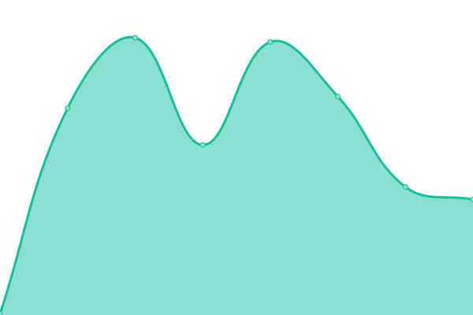

# [📈 Live Status](https://FuzzyGrim.github.io/uptime-monitor): <!--live status--> **🟩 All systems operational**

This repository contains the open-source uptime monitor and status page for [FuzzyGrim](https://FuzzyGrim.github.io/uptime-monitor), powered by [Upptime](https://github.com/upptime/upptime).

<!--start: status pages-->
<!-- This summary is generated by Upptime (https://github.com/upptime/upptime) -->
<!-- Do not edit this manually, your changes will be overwritten -->
<!-- prettier-ignore -->
| URL | Status | History | Response Time | Uptime |
| --- | ------ | ------- | ------------- | ------ |
|  [fuzzygrim.com](https://www.fuzzygrim.com/) | 🟩 Up | [fuzzygrim-com.yml](https://github.com/FuzzyGrim/uptime-monitor/commits/HEAD/history/fuzzygrim-com.yml) | 

 170ms
     
 | 

<a href="https://FuzzyGrim.github.io/uptime-monitor/history/fuzzygrim-com">100.00%</a>
    

|  [umami.fuzzygrim.com](https://umami.fuzzygrim.com/) | 🟩 Up | [umami-fuzzygrim-com.yml](https://github.com/FuzzyGrim/uptime-monitor/commits/HEAD/history/umami-fuzzygrim-com.yml) | 

 484ms
     
 | 

<a href="https://FuzzyGrim.github.io/uptime-monitor/history/umami-fuzzygrim-com">100.00%</a>
    

<!--end: status pages-->

[**Visit our status website →**](https://FuzzyGrim.github.io/uptime-monitor)

## 📄 License

- Powered by: [Upptime](https://github.com/upptime/upptime)
- Code: [MIT](./LICENSE) © [FuzzyGrim](https://FuzzyGrim.github.io/uptime-monitor)
- Data in the `./history` directory: [Open Database License](https://opendatacommons.org/licenses/odbl/1-0/)
